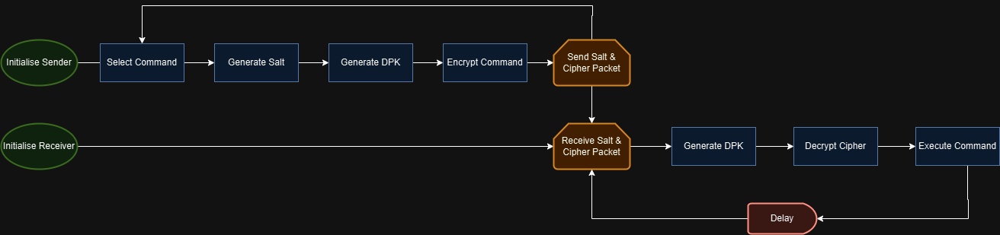
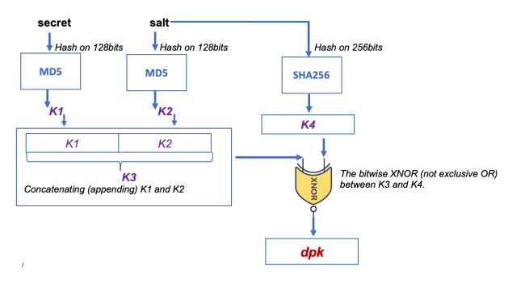

# Lightweight Authentic Wireless Communications for Micro:Bit IoT Device

## Overview

This project uses two Micro:bit v2 devices to send and recieve encrypted commands wirelessly. The system features:
1.	Capacitor Charge Detector: Displays capacitor charge level with LEDs.
2.	Memory Test: LED-based memory test.
3.	Sound Detector: LED-based noise detector.

Features:

- Encryption: Ensures secure communication between devices using a symmetric encryption key (DPK).
- Wireless Communication: Uses Micro:bit's built-in radio to send and receive commands.

### Flowchart

## Setup and Usage
### 1. The Encryption Setup

Securly sending commands involves generating a Device Pairing Key (DPK), which is used for the encryption. Setting Up a shared secret for both the transmitter and the reciever is crucial for generating the DPK:

#### Generating the DPK

The DPK is generated using a pre-set shared secret between both devices, and randomly generated salt. 

- Secret: A constant 16-byte shared secret: ``"A8QjJ3ZUqBwCOei"``.
- Salt: A randomly generated 16-byte string (not seeded).

### 2. Sending Commands

The sender encrypts the command using the DPK and AES-128 ECB-Mode before sending it via radio. Once encrypted, the commands are sent over the radio channel alongside the salt using the ``radio.datagram.send()`` function. 

### 3. Receiving Commands

The receiver listens for incoming commands using ``radio.datagram.recv()``. Upon receiving a command, it decrypts it by regenerating the DPK using the shared secret and the received salt and executes the corresponding action.

## Commands

### 1. Capacitor Charge Detector

This command involves having the users input a number from the range of 0-1023 (representing the PWM limit of the Microbit) on sudo screen, which charges the capacitor accordingly, and displaying how full the capacitor is using the 4 LEDs on the breadboard (RED, AMBER, YELLOW, GREEN). E.g. RED being a range below 256 PWM, and GREEN being a range above 768 PWM. 

### 2. Memory Test

This test uses LEDs (RED, AMBER, YELLOW, GREEN) to display a sequence of lights. The user needs to replicate the sequence using sudo screen. E.g. if the first LED is RED, the user needs to the index of the LED Light in the serial screen (i.e. 1). The following sequence would be RED and GREEN, where the user would need to input '1' and '4', having the test go one with more complex sequences until the user inputs the wrong sequence, resulting in a "Game Over".

### 3. Sound Detector

This command involves having the sending Microbit listen to sounds, and counting the amount of sounds in the environment and reflecting it on the LEDs (RED, AMBER, YELLOW, GREEN), with RED being 1 sound, and RED to GREEN being 0/4 sounds.

